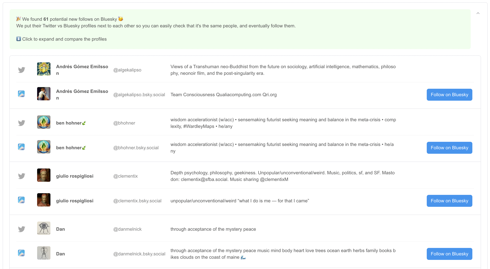

# import-twitter-following-bluesky

You follow people on Twitter. You want to follow them on Bluesky. It's tedious to do manually. This is a simple tool to make the process more convenient.

Live version: [https://gggdomi.github.io/import-twitter-following-bluesky](https://gggdomi.github.io/import-twitter-following-bluesky)



This is just a front-end, no server. Main dependencies: TypeScript, React, MobX, React Suite.
You may want to run the code locally:

```
yarn
yarn dev
```

# TODO:

- [ ] Add a "Follow all" button
- [ ] Support other import formats?
  - [ ] User script/Bookmarklet/Chrome extension to export following list without third parties? [something like this should work](./src/scrape.js)